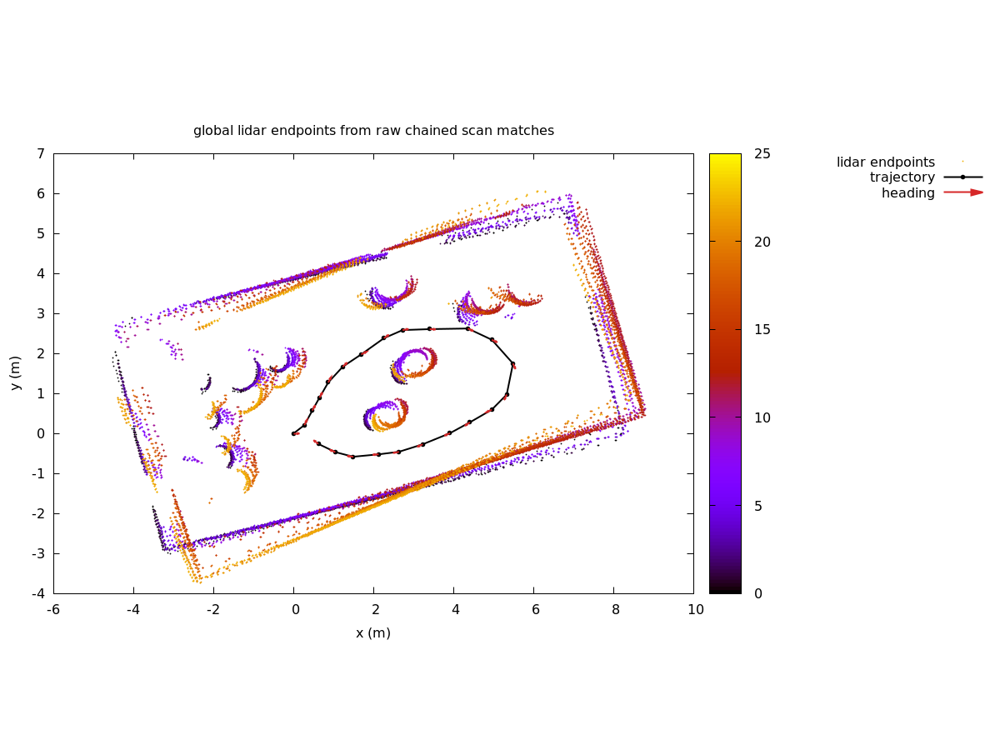
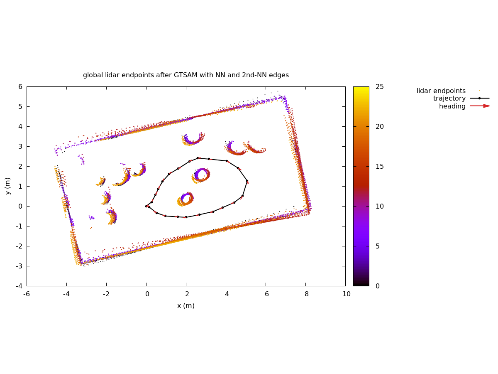
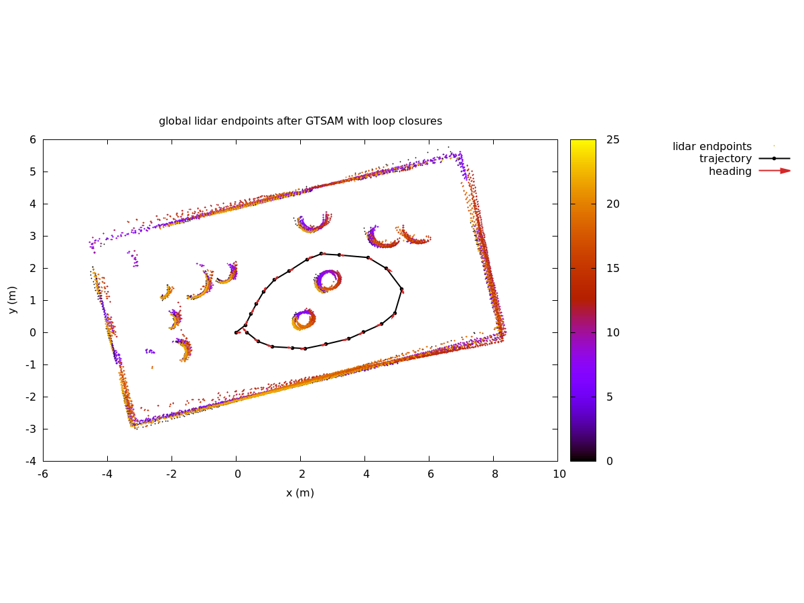
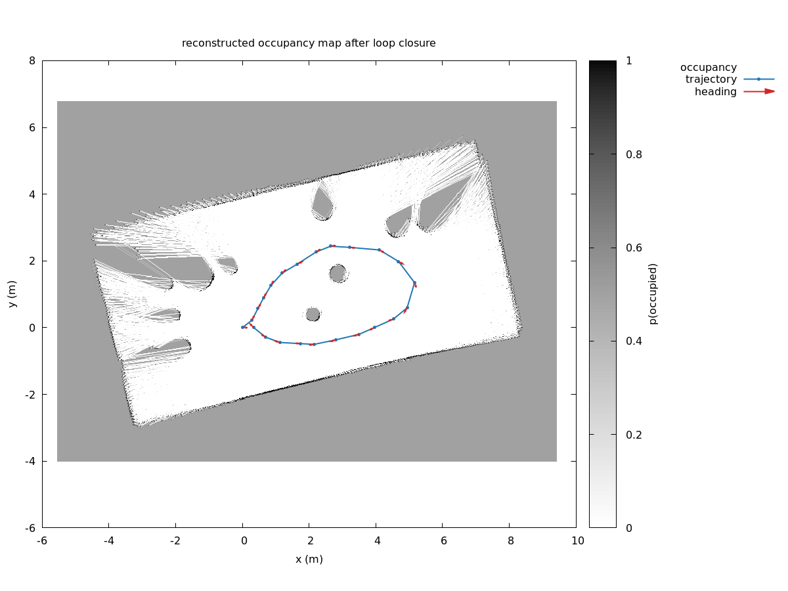
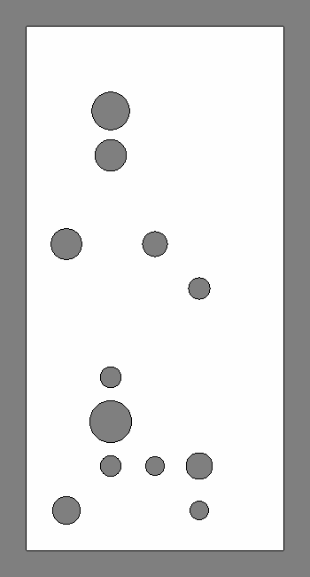

# map_solver

ROS 2 Humble `ament_cmake` package for C++ 2d-lidar scan matching and associated tinkering.

## Description

This package provides command line (offline) tools for processing stationary robot lidar scans into (in principle) high-quality occupancy maps via scan-matching followed by GTSAM optimization and occupancy map extraction. I am really just tinkering with various methods and trying to peek under the hood of (online) SLAM methods (like slam_toolbox).

### Consecutive pairwise and every-other pairwise scan matching

Using the process described in the Gazebo data generation section, I have a closed arc trajectory of some 20 waypoints, with bag files of lidar scans (etc.) collected from a stationary robot. The results below have been generated from code in ```tests/test_scan_pipeline.cpp```.

First, we attempt a scan match of all sequential pairs and stack up the transforms, reassembling the scans in a single coordinate frame using these NN scan matches:



Next, we add all sequential every-other pairs, using the relative transforms from the previous step as an initial guess. Then, we run a GTSAM optimization of this pose graph. This cleans up our lidar scans considerably:



Next, we add loop closure detection, adding seven waypoint scan matches connecting the start and end of the trajectory. And, a second GTSAM optimization of this new pose graph. This gives us a loop closure:



This has cleaned up the lidar scan overlaps quite a bit, but we still need more waypoints in the middle of the trajectory (to the right). It's possible my large waypoint spacing and/or occlusions are effecting the scan matching.

Finally, we generate an occupancy map by accumulating the log-odds ratio of all cells in the map. In this case, we use all lidar rays (they are decimated in scan-matching estimation above), but with a simple ray tracing algorithm. Further refinement would involve accounting for the variances of estimated poses and the lidar noise.



The true occupancy map is synthetically generated (see https://github.com/StuartGJohnson/WorldGeneration):



## Gazebo data generation

I have been using the following data generation process, using tools in the https://github.com/StuartGJohnson/ugv_ws repo.

Terminal 1:
(in the ugv_ws directory)

```colcon build --packages-select ugv ugv_base_node ugv_bringup ugv_description differential_drive_test ldlidar_stl_ros2 rf2o_laser_odometry safety gazebo_differential_drive_robot_4wheel point_cloud_tools frontier_explorer rviz_record ground_truth_republish trajectory_data_collector global_robot_localization mapping_data_collector map_solver --cmake-args -DCMAKE_BUILD_TYPE=Release```

```source install/setup.bash```

Terminal 1:

```ros2 launch ugv bringup_amcl_sim_gt_no_rot_localization.launch.py```

Terminal 2:
(in the ugv_ws directory)

```source install/setup.bash```

```ros2 launch mapping_data_collector mapping_data_collector.launch.py```

Terminal 3:
(in the ugv_ws directory)

```source install/setup.bash```

Set the initial pose:

```ros2 action send_goal   /LocalizeInMap   global_robot_localization/action/LocalizeInMap   "{num_scans: 1, collection_timeout: {sec: 10, nanosec: 0}, suppress_initialpose: false, suppress_markers: false}"   --feedback```

Start a new trajectory:

```ros2 action send_goal /reset_waypoints nav2_msgs/action/Wait "{time: {sec: 0, nanosec: 0}}"```

In rviz, select a series of waypoints via "Publish Point" and clicking the desired waypoint location. With an rviz configured to display the mapping_data_collector waypoints, numbered waypoints will appear.

Terminal 3:
Execute the trajectory:

```ros2 action send_goal /execute_waypoints nav2_msgs/action/FollowWaypoints "{poses: []}"```

This will generate a series of bag files in (by default) $HOME/mapping_data_collector_data.

## Math background

### Scan Matching

[Scan Matching](https://StuartGJohnson.github.io/map_solver/map_solver.pdf)

### Occupancy Map generation

TBD

## AI Assistance

Development of this package made use of OpenAI ChatGPT
(GPT-5.4/5.5) and Codex tools for code generation, documentation drafting, and technical discussion.
